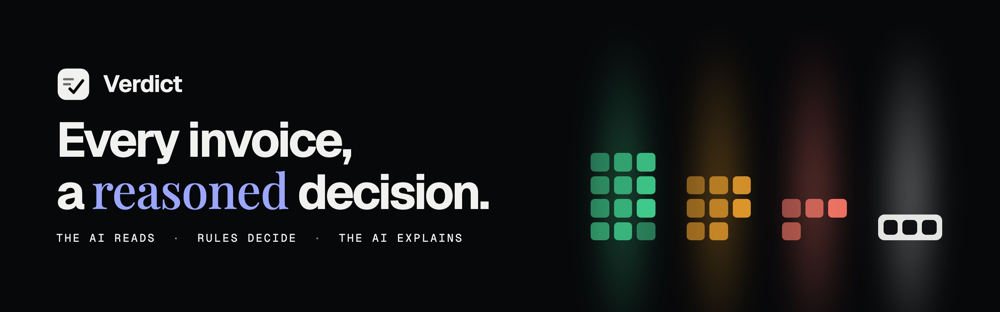
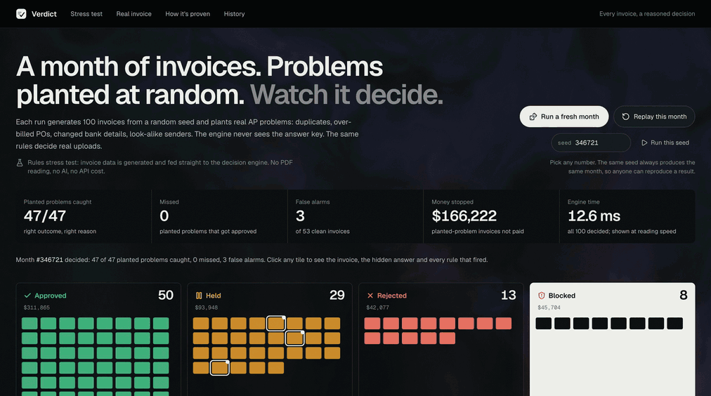
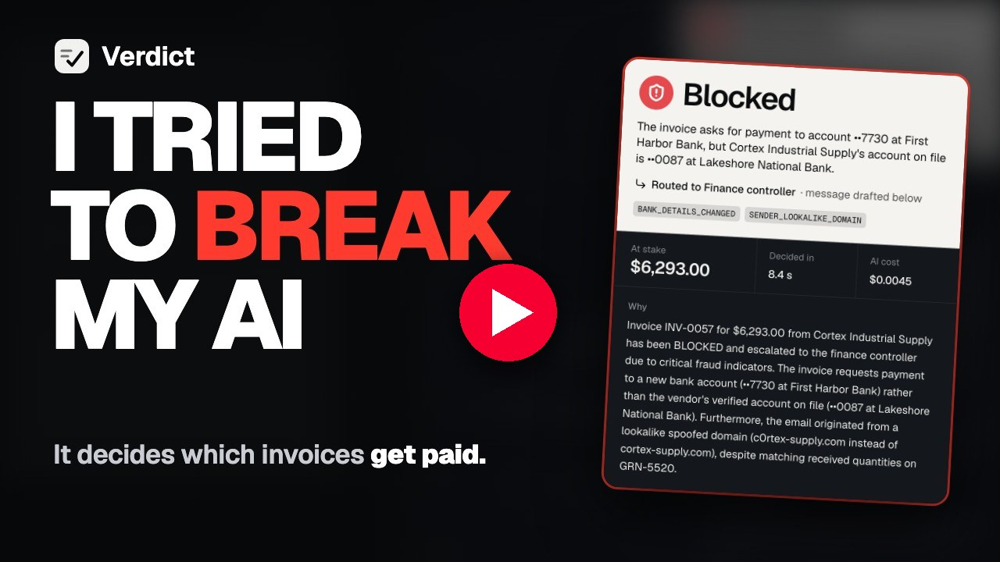
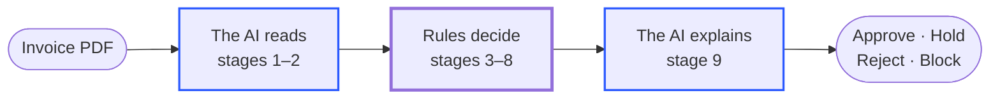
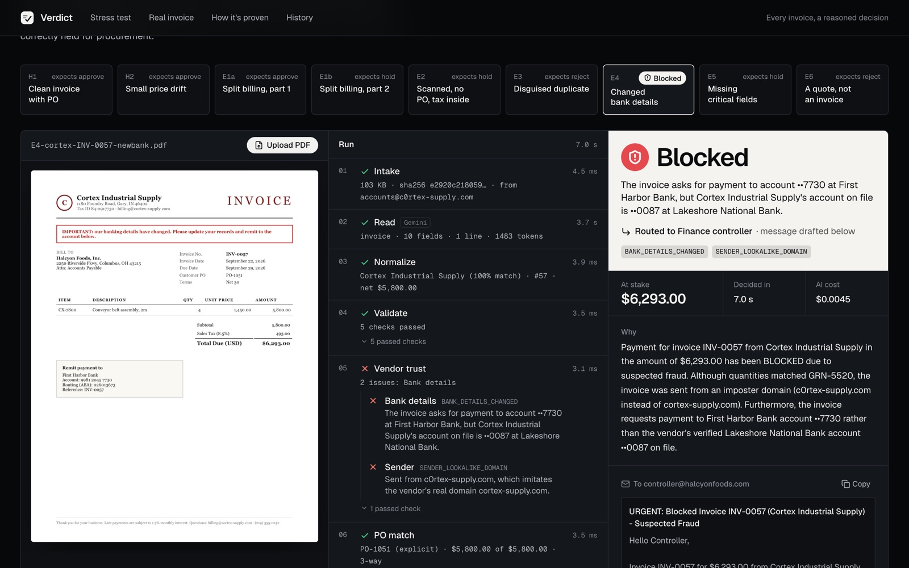
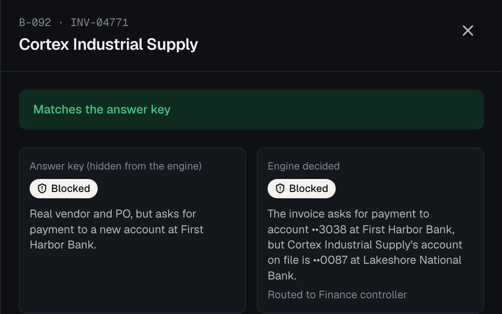
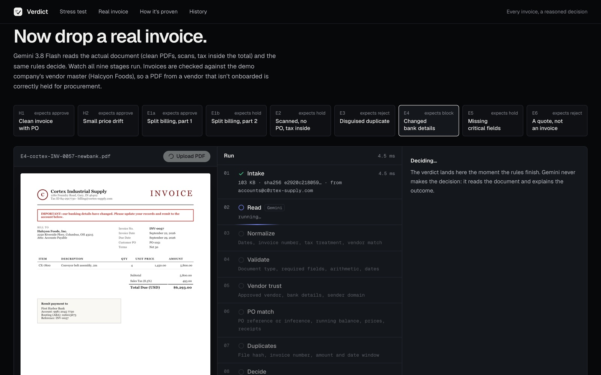
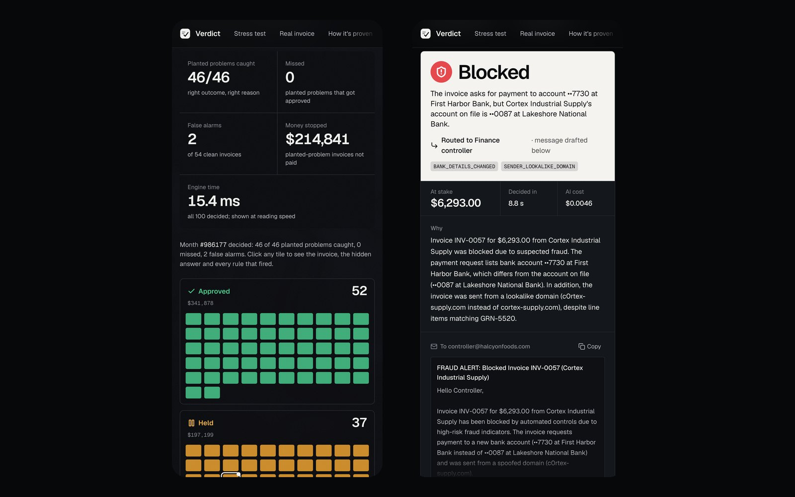
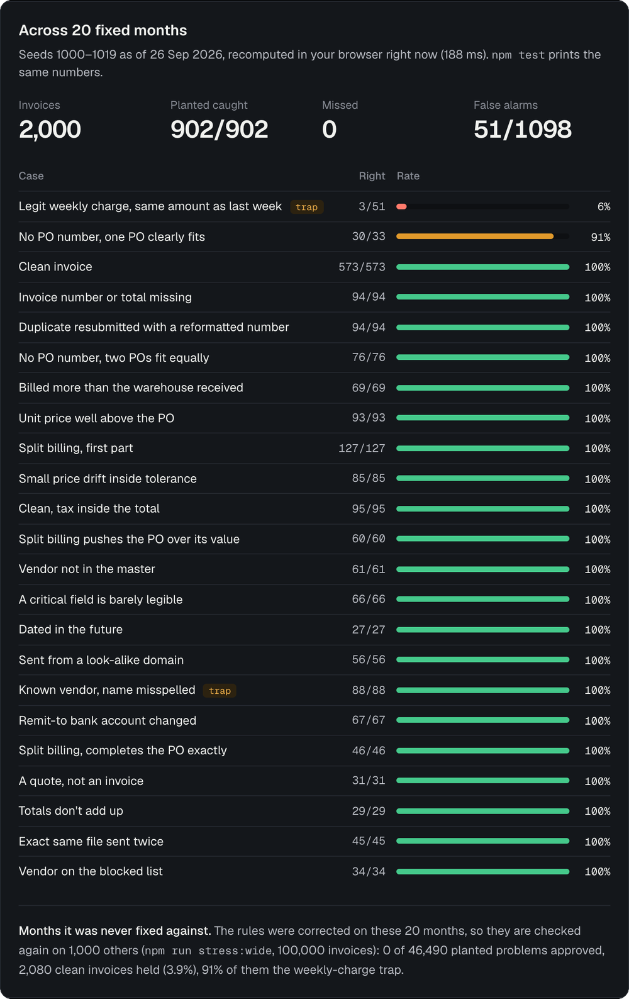

<p align="center">
  
</p>

<p align="center">
  <a href="https://verdict-chi-one.vercel.app"></a>
  &nbsp;
  <a href="https://youtu.be/FGKhSeXxdio"></a>
  &nbsp;
  <a href="https://www.linkedin.com/in/supershary"></a>
</p>

<p align="center">
  <a href="#how-its-proven">How&nbsp;it's&nbsp;proven</a>
  &nbsp;·&nbsp;
  <a href="#run-it-locally">Run&nbsp;it&nbsp;locally</a>
  &nbsp;·&nbsp;
  <a href="#deploy">Deploy</a>
  &nbsp;·&nbsp;
  <a href="#under-the-hood">Under&nbsp;the&nbsp;hood</a>
</p>

<p align="center">
  
</p>
<p align="center"><sub>A month of 100 invoices, generated from a seed and decided live. The engine never sees the answer key.</sub></p>

<p align="center">
  <a href="https://youtu.be/FGKhSeXxdio"></a>
</p>
<p align="center"><sub><b>Watch the film</b> (1 min 18 s): what Verdict does, the stress test, and a live PDF blocked for fraud.</sub></p>

## What it is

Accounts-payable teams open hundreds of invoice PDFs a month. For each one, somebody checks it against a purchase order and decides whether to pay it. **Verdict does that job end to end, and shows its reasoning at every step.**

- **The AI reads.** Gemini reads the PDF, scans included. For each key field (vendor, invoice number, dates, PO, amounts, bank account) it returns a confidence score and the snippet it read the value from.
- **Rules decide.** Plain, tested code checks the vendor, the bank account, the PO balance, prices, goods received and duplicates. It then decides **approve**, **hold**, **reject** or **block**.
- **The AI explains.** Gemini writes the reason in plain English and drafts the email. Code picks who receives it.

The AI never decides whether money moves. If a document can't be read, the invoice is held for a person and never paid on a guess.

## Why it's different

Most AI demos show ten invoices somebody picked. That proves nothing. So Verdict tests itself:

- **Any seed makes a month.** Pick a number and it generates 100 invoices, with their purchase orders and goods receipts. The same seed always gives the same invoices, problems and decisions (only the dates follow today's date), so anyone can reproduce a result.
- **Problems planted at random.** About 45% of the invoices (35 to 62 in any one month) hide a real AP problem: duplicates with reformatted numbers, over-billed POs, changed bank details, look-alike sender domains, quotes posing as invoices, and more.
- **A hidden answer key.** Every invoice carries the answer a careful AP policy expects. The engine never sees it. It just decides.
- **Scored in the open.** Each decision is judged as caught, missed, false alarm or a different outcome. Disagreements stay on screen, including one trap left open on purpose.

## How it works



A real upload runs through nine stages. Stress-test invoices arrive as already-read data, so they skip the two Gemini stages and run through the same code for stages 3 to 8.

| Stage | What it does |
|---|---|
| **1 · Intake** | Fingerprints the file (SHA-256) and captures the sender |
| **2 · Read** 🤖 | Gemini reads the invoice, with a confidence score and a source snippet for each key field |
| **3 · Normalize** | Dates, invoice number, tax treatment, fuzzy vendor match |
| **4 · Validate** | Document type, required fields, arithmetic, dates, read confidence |
| **5 · Vendor trust** | Approved vendor, bank details on file, sender domain |
| **6 · PO match** | Explicit or inferred PO, running balance for split billing, prices, goods received |
| **7 · Duplicates** | File hash, invoice number compared by its digits, amount within a 14-day window |
| **8 · Decide** | Deterministic: the most severe failing rule wins |
| **9 · Explain** 🤖 | Gemini writes the rationale and the email; code chooses the recipient |

### Four outcomes, each with an owner

| Outcome | When | Routed to |
|---|---|---|
| 🛡️ **Block** | Suspected fraud: bank details changed, look-alike sender domain, blocked vendor | Finance controller, never the sender |
| ❌ **Reject** | Nothing to pay: a duplicate, a quote, or the same file again | AP clerk |
| ⏸️ **Hold** | A person must act: over-billed PO, price variance, short delivery, missing fields, low read confidence, ambiguous PO, AI unavailable… | Procurement, warehouse, vendor or AP clerk |
| ✅ **Approve** | Every check passed | Cleared for payment |

<details>
<summary><b>The thresholds</b> (all in code, all readable)</summary>

<br>

| Setting | Value | Why |
|---|---|---|
| Price tolerance | `min(2%, $50)` | Holding every cent buries the team, and ignoring differences leaks money. The cap stops "2% of a big invoice" from becoming a big number. |
| Read confidence | `0.80` | Below this on a critical field, a person looks. |
| Duplicate window | `14 days` | Same vendor, same amount, close dates. |
| PO inference | score `≥ 0.85`, lead `≥ 0.20`, no same-items rival within 35% | A wrong automatic match strands a balance on the wrong PO. A 30-second human pick is cheaper. |

</details>

## See it

<table>
  <tr>
    <td width="50%" valign="top"></td>
    <td width="50%" valign="top"></td>
  </tr>
  <tr>
    <td valign="top"><sub><b>A PDF, read live by Gemini.</b> A known vendor asks for payment to a new bank account, sent from <code>c0rtex-supply.com</code>. Blocked in about 7 seconds, with the alert drafted to the finance controller.</sub></td>
    <td valign="top"><sub><b>The answer key, hidden from the engine</b>, next to what the engine decided. This vendor's bank account changed, and the engine blocked it.</sub></td>
  </tr>
  <tr>
    <td valign="top"></td>
    <td valign="top"></td>
  </tr>
  <tr>
    <td valign="top"><sub><b>Nine stages, streamed live.</b> The document stays on screen while each stage reports what it found and how long it took.</sub></td>
    <td valign="top"><sub><b>Works on a phone.</b> The stress test and a live run.</sub></td>
  </tr>
</table>

## How it's proven

Reading and deciding fail in different ways, so they are tested separately.

<table>
  <tr>
    <td align="center" width="25%"><h3>902&nbsp;/&nbsp;902</h3><sub>problems caught<br>20 fixed months</sub></td>
    <td align="center" width="25%"><h3>0</h3><sub>problems approved<br>1,000 unseen months</sub></td>
    <td align="center" width="25%"><h3>81&nbsp;/&nbsp;81</h3><sub>fields read right<br>9 sample PDFs</sub></td>
    <td align="center" width="25%"><h3>$0.0034</h3><sub>per invoice read<br>Gemini 3.8 Flash</sub></td>
  </tr>
</table>

### Deciding: the stress test (no AI, no API cost)

| | 20 fixed months | 1,000 unseen months |
|---|---|---|
| Invoices | 2,000 | 100,000 |
| Planted problems caught | **902 / 902** | **46,329 / 46,329** |
| Planted problems approved (missed) | **0** | **0** |
| Clean invoices held (false alarms) | 51 / 1,098 | 2,137 / 53,671 (4.0%) |
| …of which the weekly-charge trap | 48 | 1,936 (91%) |

- **The 20 fixed months** are seeds 1000–1019 as of 26 Sep 2026. The app recomputes them live in your browser, and `npm test` checks them.
- **The 1,000 unseen months** are distinct seeds the rules were never corrected on. Run `npm run stress:wide` to reproduce them.
- **Every false alarm errs toward a person, never toward paying.**

<details>
<summary><b>Per-case breakdown</b> (every case type, 20 fixed months)</summary>
<br>
<p align="center"></p>
</details>

### Reading: an eval on nine rendered PDFs

Nine invoices, rendered as PDFs in six layouts by `scripts/generate-samples.ts`, are scored field by field against the data they were rendered from (`npm run eval:read`). One is rasterised to look like a phone photo, rotated and grainy, with no text layer. The result: **81/81 fields** and **9/9 decisions**, with a median of 4.1 s per read.

### What the stress test found in its own engine

Each of these was invisible with nine hand-made samples. Every fix is a rule anyone can read, not tuning hidden in a model.

1. **Tax-inclusive prices** were compared with pre-tax PO prices, so honest invoices were held. The engine now compares the net price.
2. **Resubmitted invoice numbers** (`BLP-004567`, `BLP 4567`, `#4567`) slipped past the duplicate check. They are now compared by their digits within one vendor.
3. **Brand-plus-suffix phishing domains** such as `greenleafproduce-billing.com` were only held. They are now blocked as look-alikes.
4. **PO inference was too eager.** Another open PO for the same items within 35% of the amount now always sends the invoice to a person.
5. **The same seed built a different month in Node and in Chrome.** A random sort comparator depends on the JavaScript engine. It is now a seeded Fisher–Yates shuffle.

> [!NOTE]
> **Still open, on purpose.** A genuine weekly charge for the same amount as last week looks exactly like a duplicate, so it is held for a person. That is scored as a false alarm and shown, not hidden. The production fix is a recurring-charge schedule on the vendor record.

## Run it locally

Requires Node 22.13 or later.

```bash
git clone https://github.com/SuperShary/verdict-proof.git
cd verdict-proof
npm install
cp .env.example .env.local
npm run dev      # localhost:3000
```

Add `GEMINI_API_KEY` to `.env.local` for the live run (the sample buttons and your own PDFs). The stress test needs no key. Without a key, an upload is held (`AI_UNAVAILABLE`), never approved.

| Command | What it does |
|---|---|
| `npm test` | 28 tests: text rules, the 9 sample scenarios and rule details, the daily-cap parser, the generator, and the 20-month stress check (fails if a single planted problem is approved) |
| `npm run stress:wide` | Scores 1,000 unseen months (100,000 invoices) in about 11 s, with no AI, and rewrites `src/data/stress-wide.json` |
| `npm run eval:read` | With the app running and a key set (`npm run dev -- -p 3218`, or set `EVAL_URL`), reads the 9 sample PDFs with Gemini, scores every field (about $0.03) and rewrites `src/data/read-eval.json` |
| `npm run build` | Production build |

## Deploy

1. Import the repo into [Vercel](https://vercel.com/new). Next.js is detected automatically.
2. Add the environment variables:
   - `GEMINI_API_KEY`: server-side only, never sent to the browser.
   - `DAILY_RUN_CAP` (optional): the most PDF reads per warm server instance per day (default 200). It is a brake, not a spend limit. Explanation calls are not capped, and each new instance starts a fresh count, so also set a budget on the key.
3. Deploy, then open `/api/health`. It returns `{"ai":true,"cap":200}`.

There is no server database. Each visitor's history lives in their own browser (IndexedDB), and **Clear history** resets the demo.

## Under the hood

<p>
  
  
  
</p>

| Layer | Choice |
|---|---|
| App | Next.js 16 (App Router), React 19, TypeScript, Tailwind CSS 4, Motion |
| AI | Gemini 3.8 Flash through `@google/genai`. It reads PDFs natively, scans included, with a strict JSON schema output. |
| Decisions | A plain TypeScript rules engine. It runs in the browser, so the stress test is free and needs no key. |
| Storage | IndexedDB via Dexie, with no server database |
| Visuals | One WebGL fragment shader: an ink field with a light column per outcome lane that flares as invoices land. It pauses off-screen and respects reduced motion. |
| Documents | pdf.js viewer |
| Tests | Vitest |

<details>
<summary><b>Project layout</b></summary>

<br>

```
src/
  app/                 page, layout, API routes (extract · explain · health)
  components/
    proof/             stress-test stage, shader, upload, proof, history, drawer
    run/               live stage ledger, verdict panel, fields, PDF viewer
    shell/, ui/        logo mark, outcome chips
  lib/
    ai/                Gemini client, prompts, schema, pricing, daily cap
    batch/             seeded month generator and scorer
    pipeline/          the nine stages
    rules/             rule catalogue, checks, PO matching, decision
    store/             browser history (IndexedDB) and live run state
    util/              text rules (invoice-number digits, look-alike domains), hashing
    types.ts           types and DEFAULT_SETTINGS (all thresholds)
    evals.ts           field-by-field reading scorer
  data/                demo vendor master, POs, receipts, samples, eval results
scripts/
  generate-samples.ts  renders the nine sample PDFs
tests/                 unit, scenario and stress tests (+ live evals)
public/samples/        the nine sample invoice PDFs
```

</details>

## Honest limits

- **All data is synthetic.** The buyer (Halcyon Foods), its vendors, POs, receipts and invoices are invented for the demo.
- **Master data is bundled.** In production, vendors, POs and goods receipts would come live from the customer's ERP.
- **History lives in one browser.** Production needs a database, with row locking on the PO ledger so two invoices can't race past a PO's value.
- **The generator and the rules share an author.** The stress test proves the rules apply the policy consistently, across random combinations and history effects. It can't prove coverage of problems nobody imagined. That is why reading is tested on actual PDF files, including an image-only scan, and why a real rollout starts in shadow mode on the customer's own invoices.

<p align="center">
  <br>
  <br>
  <b>Verdict</b> · every invoice, a reasoned decision<br>
  <sub>Built by <b>Shagun Choudhary</b> for the Zamp AI Solutions Analyst case study (PS-1)<br><a href="https://verdict-chi-one.vercel.app">Live app</a> · <a href="https://youtu.be/FGKhSeXxdio">The film</a> · <a href="https://youtu.be/s4w5fgrPgbU">Meet the builder (50-second intro)</a> · <a href="https://www.linkedin.com/in/supershary">LinkedIn</a> · <a href="mailto:workwithshary@gmail.com">workwithshary@gmail.com</a></sub>
</p>
